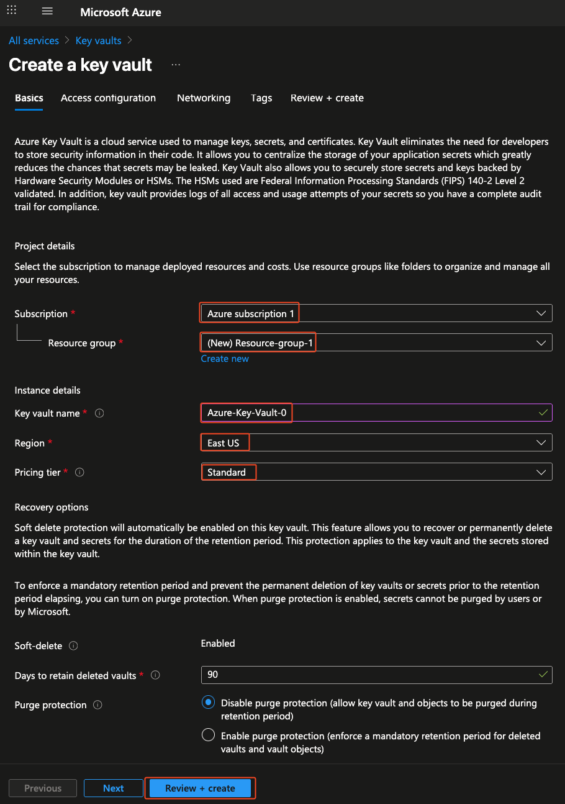
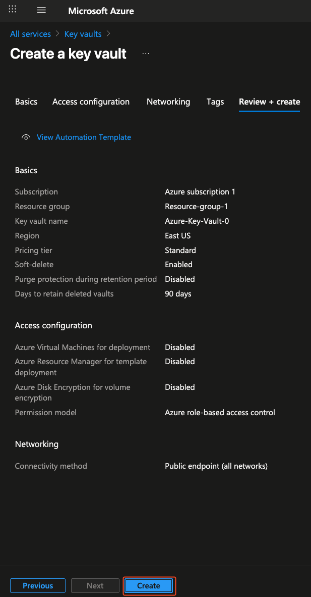

# 🔐 Create Azure Key Vault - Step by Step Guide

This guide explains how to create and configure an **Azure Key Vault** using the **Azure Portal**.  
Key Vault is used to securely store and manage secrets, keys, and certificates.

---

## 📋 Prerequisites
- An active [Azure subscription](https://azure.microsoft.com/free/).

---

## 🖥️ Using Azure Portal
1. Go to the [Azure Portal](https://portal.azure.com/).
2. In the search bar, type **Key Vault** and click **+ Create**.
3. Fill in the required fields:
   - **Subscription**: Select your subscription.
   - **Resource Group**: Create a new one or select an existing one.
   - **Key Vault Name**: Must be globally unique.
   - **Region**: Choose the region closest to you.
   - **Pricing Tier**: Standard (default).
4. Click **Review + Create** → **Create**.
5. Once deployed, open the Key Vault and note its **Vault URI** (you’ll use this in apps).

---

✅ You now have a Key Vault created and ready to use!
