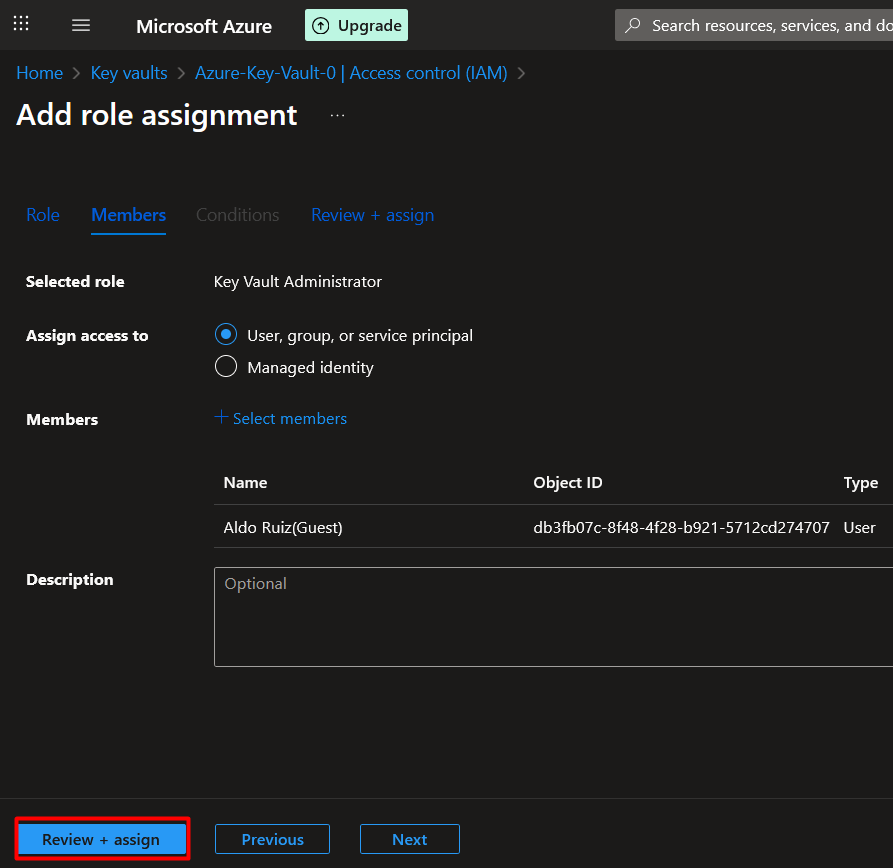

# 🔐 Create Azure Key Vault - Step by Step Guide

This guide explains how to create and configure an **Azure Key Vault** using the **Azure Portal**.  
Key Vault is used to securely store and manage secrets, keys, and certificates.

---

## 📋 Prerequisites
- An active [Azure subscription](https://azure.microsoft.com/free/).

---

## 🖥️ Using Azure Portal
1. Go to the [Azure Portal](https://portal.azure.com/).
2. In the search bar, type **Key Vault** and click **+ Create**.
3. Fill in the required fields:
   - **Subscription**: Select your subscription.
   - **Resource Group**: Create a new one or select an existing one.
   - **Key Vault Name**: Must be globally unique.
   - **Region**: Choose the region closest to you.
   - **Pricing Tier**: Standard (default).
4. Click **Review + Create** → **Create**.
   
   
6. Once deployed, open the Key Vault and note its **Vault URI** (you’ll use this in apps).
7. Get the role **Key Vault Administrator** to have full control over the vault.
   1. Go to your vault and select **Access control (IAM)**, then select **+ Add** -> **Add role assignment**.
      
   2. Select **Key Vault Administrator** and then select **Next**.
      > ⚠️ **Warning:** Key Vault Administrator gives full control over the vault (read, write, delete, access policies).  
      > If you only need the application to read secrets, Key Vault Secrets User is safer.
      
      
   4. Click on **+ Select members** and add your user.
      
      
      
      
      
9. Create a secret
   1. Go to **Objects** -> **Secrets**.
   2. Select **+ Generate/Import**.
   3. Add a **Name** and **Secret value**, then select **Create**.
10. 

---

✅ You now have a Key Vault and a Secret created and ready to use!
