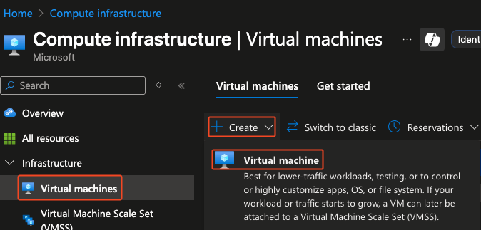

# 🖥️ Create Azure Virtual Machine

This guide explains how to create a **Virtual Machine** using **Azure Portal**.  

---

## 📋 Prerequisites
- An active [Azure subscription](https://azure.microsoft.com/free/).

---

## Create Virtual Machine in Azure Portal
1. Go to the [Azure Portal](https://portal.azure.com/).
2. In the search bar, search for **Virtual Machines**.
3. Select **Create** and then **Virtual Machine**.
   
   
   

---

✅ You now have a Virtual Machine with Ubuntu, docker and SQL Server ready to use!
