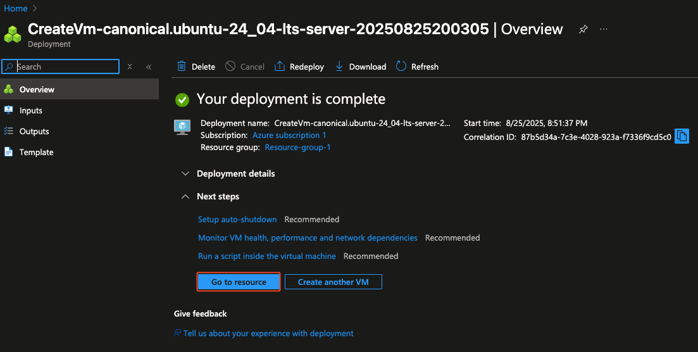

# 🖥️ Create Azure Virtual Machine

This guide explains how to create a **Virtual Machine** using **Azure Portal**.  

---

## 📋 Prerequisites
- An active [Azure subscription](https://azure.microsoft.com/free/).

---

## Create Virtual Machine in Azure Portal
1. Go to the [Azure Portal](https://portal.azure.com/).
2. In the search bar, search for **Virtual Machines**.
3. Select **Create** and then **Virtual Machine**.
   
   
4. Complete the parameters for your virtual machine and select **Review + create**.
   
   
   
   
6. Select **Create**.
   
   
   
   
   
   
7. Download your private key, you will use it to access with ssh.
   
   
9. Wait until the deployment is complete and select **Go to resource**.

   
10. Get your Public IP address.

    
11. We are going to install docker and sqlserver container.
    1. Go to **Network Settings**, select **+ Create port rule** and select **Inbound port rule**

       
    2. Add the port 1433 for sqlserver.

       
12. Access to VM with ssh:
    1. For MacOS, run in terminal.
       ```bash
       chmod 400 ~/Downloads/VM-1_key.pem
       ```
    2. Use ssh to access the VM.
       ```bash
       ssh -i ~/Downloads/VM-1_key.pem azureuser@48.217.82.170
       ```
14. Install Docker
    1. Update:
       ```bash
       sudo apt update
       sudo apt upgrade -y
       ```
    2. Install docker and docker compose.
       ```bash
       sudo apt install -y docker.io docker-compose-v2
       ```
    3. Enable docker service to start at startup.
       ```bash
       sudo systemctl enable --now docker
       ```
    4. Enable docker for current user (you need to log out and log back in).
       ```bash
       sudo usermod -aG docker ${USER} 
       ```
    5. Create the file docker compose and add the container.
       ```bash
       nano docker-compose.yml
       ```
       1. Copy and paste the code inside the file [sqlserver.yaml](https://github.com/aldoruizw/docker/blob/main/sqlserver/sqlserver.yaml).
       2. Control + X.
       3. Y.
       4. Enter.
    6. Run docker compose.
       ```bash
       docker compose up -d
       ```
15. Add demo databases.
    1. Go inside the sqlserver container.
       ```bash
       sudo docker exec -it sqlserver sh
       ```
       1. Create a folder to store the .bak files.
          ```bash
          mkdir -p /var/opt/mssql/backup
          ```
       2. Go to the folder.
          ```bash
          cd /var/opt/mssql/backup
          ```
       3. Download the .bak files.
          ```bash
          wget https://github.com/Microsoft/sql-server-samples/releases/download/adventureworks/AdventureWorks2022.bak
          wget https://github.com/Microsoft/sql-server-samples/releases/download/adventureworks/AdventureWorksDW2022.bak
          wget https://github.com/Microsoft/sql-server-samples/releases/download/adventureworks/AdventureWorksLT2022.bak
          ```
    2. Connect to SQL Server with your preferred IDE, I will use [cloudbeaver](https://github.com/aldoruizw/docker/blob/main/cloudbeaver/cloudbeaver.yaml).
       1. Create a connection with these parameters.
          1. Host: **48.217.82.170**
          2. Port: **1433**
          3. Authentication: **SQL Server Authentication**
          4. User: **sa**
          5. Password: **YourStrongPassword123!**
       2. Execute this script to add the databases.
          ```bash
          RESTORE DATABASE AdventureWorks2022
          FROM DISK = '/var/opt/mssql/backup/AdventureWorks2022.bak'
          WITH MOVE 'AdventureWorks2022' TO '/var/opt/mssql/data/AdventureWorks2022.mdf',
               MOVE 'AdventureWorks2022_log' TO '/var/opt/mssql/data/AdventureWorks2022.ldf',
               REPLACE;

          RESTORE DATABASE AdventureWorksDW2022
          FROM DISK = '/var/opt/mssql/backup/AdventureWorksDW2022.bak'
          WITH MOVE 'AdventureWorksDW2022' TO '/var/opt/mssql/data/AdventureWorksDW2022.mdf',
               MOVE 'AdventureWorksDW2022_log' TO '/var/opt/mssql/data/AdventureWorksDW2022.ldf',
               REPLACE;

          RESTORE DATABASE AdventureWorksLT2022
          FROM DISK = '/var/opt/mssql/backup/AdventureWorksLT2022.bak'
          WITH MOVE 'AdventureWorksLT2022_Data' TO '/var/opt/mssql/data/AdventureWorksLT2022.mdf',
               MOVE 'AdventureWorksLT2022_Log'  TO '/var/opt/mssql/data/AdventureWorksLT2022.ldf',
               REPLACE;
          ```
       3. You will find the 3 demo database in your sqlserver instance.

---

✅ You now have a Virtual Machine with Ubuntu, docker and SQL Server ready to use!
